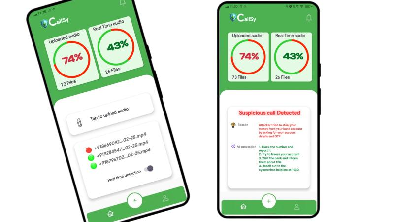

# 📱 CallSy / v1.0

> **CallSy** is an AI-powered **Android scam call detection app** that protects users from fraudulent phone calls by analyzing speech, detecting scam-related keywords, and providing real-time alerts — all with a strong focus on privacy and explainability.

---

## ✨ Key Features

- ✅ Real-Time Scam Call Detection
- ✅ Speech-to-Text using OpenAI Whisper (locally or via API)
- ✅ Scam Keyword & Sentiment Analysis via LLaMA 3.2 NLP
- ✅ Highlights Risky Phrases (e.g., "OTP", "CVV", "bank")
- ✅ Explainable AI Output with Confidence Score
- ✅ Automatic Post-Call Analysis & Flagging
- ✅ Secure, Offline & Self-hosted Backend Integration
- ✅ Scam History Dashboard & Call Block Option
- ✅ Multi-language & Lightweight Android Support

---

## 🛠️ Tech Stack

- **Frontend**: Android (Java / Kotlin)
- **AI Tools**: OpenAI Whisper (Speech-to-Text), LLaMA 3.2 (NLP), Sentiment Analysis
- **Backend**: Flask / FastAPI (Optional for self-hosted processing)
- **Database**: RoomDB (on-device), Optional PostgreSQL (backend)
- **Others**: Retrofit, Firebase (optional), ffmpeg (for audio conversion)

---

## 📱 Installation (For Users)

1. Clone the repo or download the APK.
2. Allow permissions (Microphone, Storage, Caller ID).
3. App automatically runs in background and analyzes call after completion.
4. View alerts in dashboard.

---

## ⚙️ Developer Setup

> Clone the project:

```bash
git clone https://github.com/scriptbyayush/CallSy-AntiScam-AI.git
cd CallSy-AntiScam-AI
```

> Android Studio:

- Open the project in Android Studio.
- Sync Gradle.
- Update API keys and endpoint in `Constants.kt`.
- Connect your device/emulator and run the app.

---

## 🧪 Sample Flow

```java
// After call ends
String audioPath = AudioRecorder.getLastCallAudio();
String transcript = WhisperTranscriber.transcribe(audioPath);
ScamResult result = NLPAnalyzer.analyze(transcript);

if(result.isScam()) {
    AlertManager.showScamWarning(result);
}
```

---

## 📷 Screenshots

| Scam Alert | 
|-----------|
|  |

---

## 📦 Backend Setup (Optional)

```bash
# Create virtual environment
python -m venv venv
source venv/bin/activate

# Install dependencies
pip install -r requirements.txt

# Run server
python app.py
```

---

## 🧠 AI Models Used

- **OpenAI Whisper** – Speech to Text
- **LLaMA 3.2 NLP** – Contextual Language Understanding
- **VADER / Custom Sentiment Analyzer** – Detect tone and emotional manipulation
- **Keyword Pattern Engine** – Detects sensitive terms (e.g., OTP, PAN, CVV)

---

## 🔐 Privacy & Ethics

- No third-party server calls unless explicitly configured
- Local device processing available for Whisper + NLP
- User consent taken for microphone access
- Transparent scam detection logic

---

## 🚀 Coming Soon

- 🔒 OTP Interception Protection
- 🌐 Cloud Sync for History (Encrypted)
- 🧠 Continuous Learning from User Feedback

---

## 📬 Contact

- 📧 Email: [ayush.pict@gmail.com](mailto:ayush.pict@gmail.com)
- 🌐 Website: [www.callsy.ai](https://callsy.ai) *(Coming Soon)*

---
